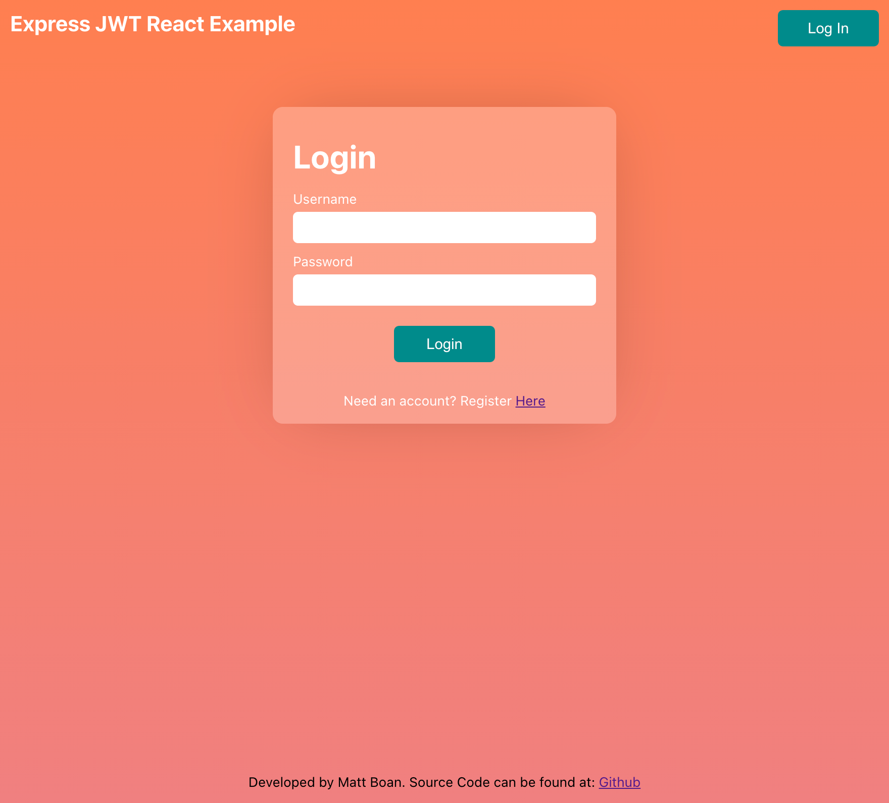

# express-jwt-react

This project was aimed at understanding how to create a secure React JS SPA web app that allows for dynamaic routing based on current authentication/authorization status verified by an Express JS API using JWT tokens.

Here is a screen shot of the React JS SPA web app login screen:



## Dependencies

Install all of the dependencies enter this in the terminal within the root of this projects directory:

```
npm install
```
To install all of the dependencies for the front end, enter this in the terminal within the root of this projects directory:

```
cd front-end && npm install
```

The next step is to setup the MySQL database. To do this open up the mysql CLI on your system.

```
mysql -u <MySQL username> -p
```

Next enter in this command in the MySQL CLI:

```
source ./MySQL/setup.sql
```

Next it is imperative to create the dotenv variables for the back end in the root of this projects directory:

```
touch .env
```

This will create a file to store the projects environment variables open the file and enter:

```
TOKEN_SECRET=<a secret key for signing the JWT>
DB_HOST=localhost
DB_USER=<database username>
DB_PASS=<database usernames password>
DB_DB=express_jwt_react_dev_db
```

## Executing

There are two parts to this application that need to be started seperately when in "developer mode"; the front and back end.
To start the back end side in the root of this projects directory enter:

```
npm start
```

Next to start the front end open another terminal and from the root of the project directory enter:

```
cd front-end && npm start
```

This will start the ReactJS development server which should open the locally hosted application in your default web browser at: localhost:3000

> Happy Coding.
